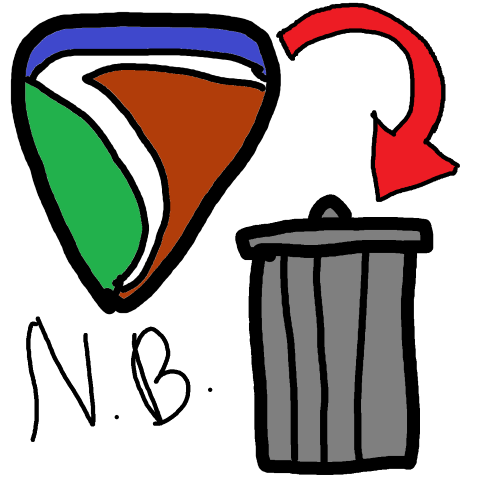
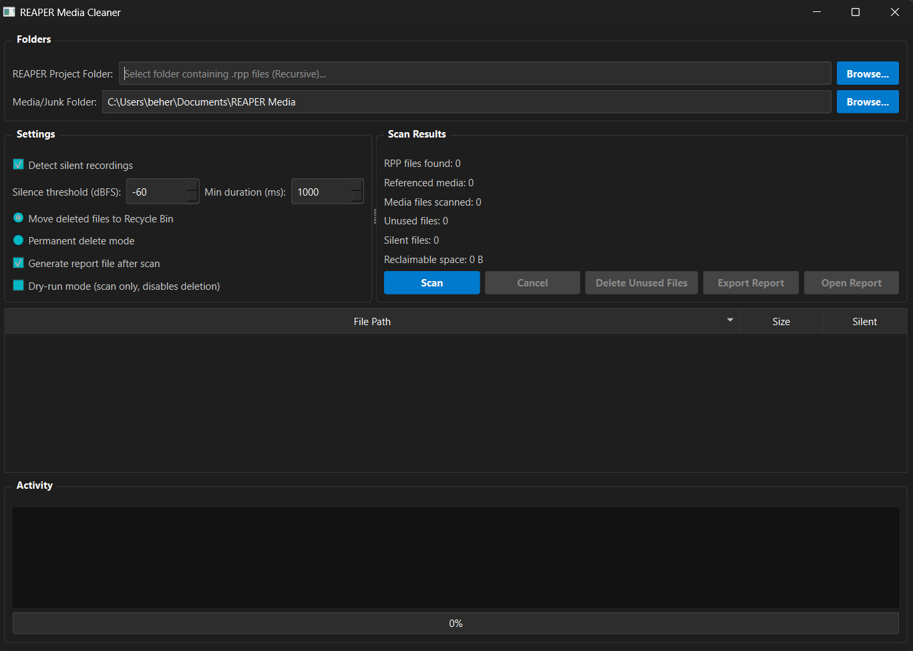

# REAPER Media Cleaner
<p align="center">
  
</p>


A modern PySide6 desktop application to safely clean unused and silent media files from your REAPER projects.

## Features

- **Project Scanning**: Recursively scans your REAPER project folders for `.rpp` files and extracts all referenced media files, resolving both relative and absolute paths accurately.
- **Media Cleanup**: Scans a separate media/junk folder and compares it to the referenced files, isolating files that are safe to delete.
- **Silence Detection**: Optionally uses `pydub` to perform amplitude analysis (dBFS) to detect blank/silent recordings that REAPER might have created.
- **Safe Deletion**: Integrated with `send2trash` to move files to the Recycle Bin rather than permanently deleting them by default.
- **Dry-run Mode**: Scan and see what would be deleted without risking any files.
- **Exporting**: Generates TXT or CSV reports of unused and silent files.
- **Modern UI**: A responsive, multithreaded dark-mode interface built with PySide6. All contained within a single Python script.

## UI Options Explained

- **Detect silent recordings**: Uses `pydub` to scan all unused files. If a file's amplitude is lower than the given threshold, it is flagged as "Silent".
- **Silence threshold (dBFS)**: The volume ceiling for a clip to be considered silent. `-60` dBFS is a standard low-noise floor for silence. Any clip peaking below this number is flagged.
- **Min duration (ms)**: Clips shorter than this duration (in milliseconds) will not be checked for silence and will default to non-silent.
- **Move deleted files to Recycle Bin**: (Recommended) When deleting unused files, they are safely sent to your system's Recycle Bin rather than permanently destroyed, allowing you to restore them if a mistake is made.
- **Permanent delete mode**: Bypasses the Recycle Bin and deletes files from the disk completely.
- **Generate report file after scan**: Automatically creates an `unused_reaper_media.txt` report in the app directory once a scan concludes.
- **Dry-run mode (scan only, disables deletion)**: Secures the application by disabling the delete button, allowing you to scan and review what files are unused without any risk of accidental deletion.

## Requirements

The application requires Python 3.8+ and the dependencies listed in `requirements.txt`:
- `PySide6`
- `pydub`
- `send2trash`
- `pyinstaller` (for building the EXE)

### FFmpeg (Important!)
Because `pydub` relies on external encoders/decoders to read files other than standard WAVs, **you must have `ffmpeg` or `ffprobe` installed and available in your system's PATH** if you are scanning compressed audio formats (like MP3, OGG, FLAC). If you only work with `.wav` files, this is not strictly necessary.

## Running from Source

1. Clone or download the repository.
2. Install the required Python packages:
   ```bash
   pip install -r requirements.txt
   ```
3. Run the script:
   ```bash
   python reaper_cleaner.py
   ```

## Building as a Standalone Executable (EXE)

You can compile this Python app into a single, standalone Windows `.exe` that does not require Python to be installed on the host machine.

### Method 1: Using the provided batch script (Windows)
Simply double-click the `build.bat` file. It will install the required dependencies, clear any old PyInstaller caches, and build the EXE (along with its custom icon).

### Method 2: Manually via Command Line
Run the following command from the project root:
```bash
pyinstaller --noconfirm --clean --onefile --windowed --icon "assets\icon.ico" --name "ReaperCleaner" reaper_cleaner.py
```
*Note: The `--windowed` flag ensures no command-prompt window opens in the background when you run the app.*

The compiled executable will be located in the automatically generated `dist` folder.
